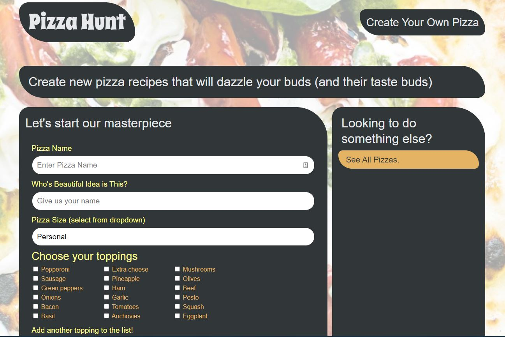

# Pizza Hunt

## Purpose
A social media application that lets users connect with each other based on their love of pizza. In Pizza Hunt, users can share and discuss their dream pizza-topping combinations.

## Features
When the user launches the website, they can see all of the previous pizza creations that other users have posted. The user can create new pizza masterpieces by filling out the provided information fields and toppings check boxes. The creation will then be submitted to be included as part of the greater collective

## Built With
* JavaScript
* Node JS 
* NoSQL - MongoDB
* Mongoose
* Express
* Heroku

## Website
https://pizzahunt2020.herokuapp.com/

## API testing
Postman

## Usage
To run program locally: node server

## Project Status
The e-commerce application is compliant with defined acceptance criteria

## Contribution
Created by Jennifer Mulder
